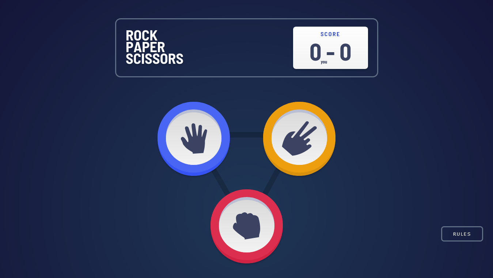
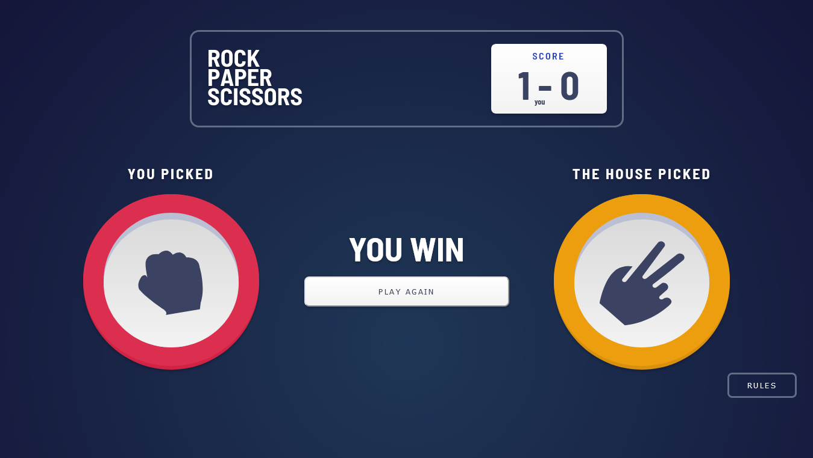
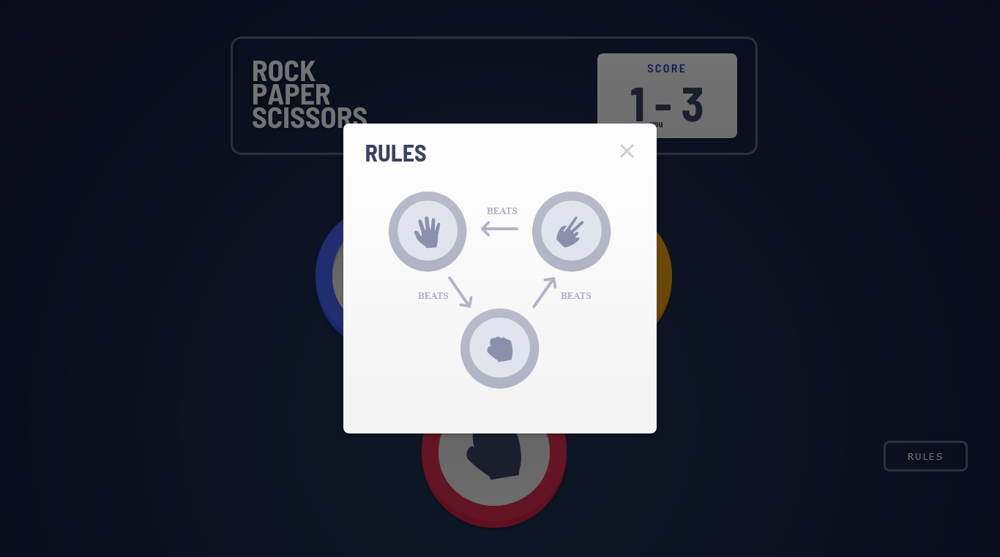

# Rock, Paper, Scissors solution

This is a solution to the [Rock, Paper, Scissors challenge on Frontend Mentor](https://www.frontendmentor.io/challenges/rock-paper-scissors-game-pTgwgvgH). 

## Table of contents

- [Overview](#overview)
  - [The challenge](#the-challenge)
  - [Screenshots](#screenshots)
  - [Links](#links)
  - [Built with](#built-with)
- [Author](#author)

## Overview

### The challenge

Users should be able to:

- View the optimal layout for the game depending on their device's screen size
- Play Rock, Paper, Scissors against the computer
- Maintain the state of the score after refreshing the browser

### Screenshots

### Links

- [Repository](https://github.com/clarencejulu/rock-paper-scissors) 
- [Live Site](https://clarencejulu.github.io/rock-paper-scissors/)

### Built with

- HTML
- SASS
- Vanilla JS
- Media Queries
- LocalStorage

## Author

- Frontend Mentor - [@clarencejulu](https://www.frontendmentor.io/profile/clarencejulu)
- Github - [My Github](https://github.com/clarencejulu)

